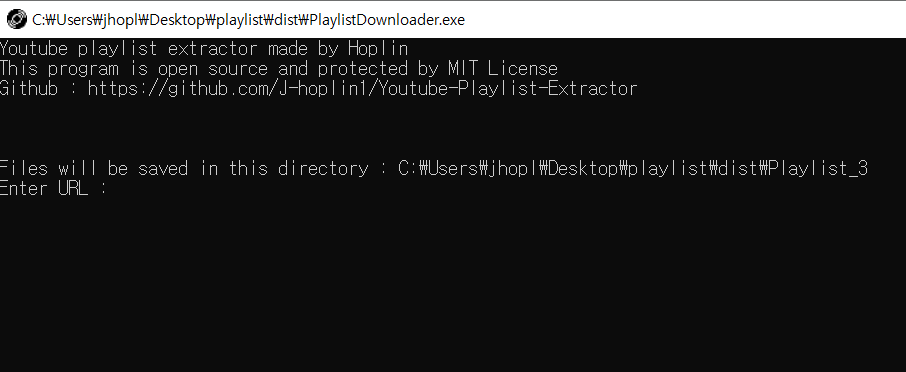
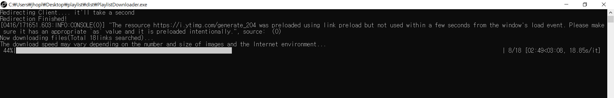

Youtube playlist Extractor
===
***
- Language : Python3(Version 3.7.6)

- IDE : Jetbrain Pycharm

- Only support Windows 64bit

- What for? : To extract mp3,mp4 files from youtube playlist automatically

- **Warning : You shouldn't use openly or share downloaded mp3 or mp4 files. If you violate this, you can be punished by copyright law.** 
***
**유튜브 정책약관에 따른 법률사항 (Legal Matters according to Youtube policies)**

- **해당 소프트웨어 제작자 hoplin은 기술적 수단만 제공할 뿐, 이 소프트웨어를 이용하는 과정에서 발생하는 위법행위에 대한 책임은  사용자가 100%책임져야합니다.**

- **The software creator Hoplin provides only technical means, and the user shall be 100% responsible for any misconduct arising from the use of the software.**

- **이 소프트웨어를 이용하여 다운로드한 영상/음원 무단배포로 일어난 문제에 대해서 저는 책임지지 않습니다**
***
- Make sure your playlist you want to extract set as public

- I just make this code as toy project. Do not use this software in bad intention. 

- **I highly recommend to use [Youtube Premium](https://www.youtube.com/premium) payment to save videos and listen as mp3.**

- **이 프로그램 대신 유튜브 프리미엄 사용을 강력히 권장드립니다.**
***

1. It'll take some time when execute program for the first time. You need to execute program in same directory with chromedriver.exe

2. When you first execute program you need to enter URL of video you want to extract. If entered link is not types of youtube video, program will be closed

    

3. After you enter playlist URL, software will download automatically all of the files in playlist.

    
    
4. mp4 files goes to mp4 directory of playlist, and mp3 files goes to mp3 directory of playlist

    ![img[(imggg/3.PNG)
